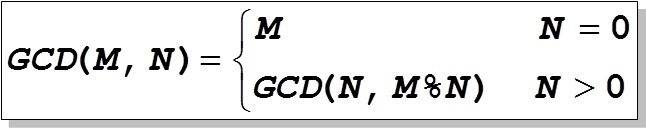

## 函数function

例： 编写程序求2个整数m和n(假设m>=n)的最大公约数.



即：
```
 GCD(72,27) = GCD(27,18)
  	        = GCD(18,9)
	          = GCD(9,0)
	          = 9
            
```
思路： 不断重复： 用n作为新的m，而（m除以n得到余数）k作为新的n，直到n等于0为止，此时的m就是原来的两个数的最大公约数
```
    #include <stdio.h>
    void main(){
	int m=72,n=27;	
	while(n){
		int k = m%n;
		m = n; n = k;
	}	
	printf("GCD is %d\n",m);
    }
```
假如需要多次求2个整数的最大公约数，怎么办？ 可以“复制黏贴代码”，如下所示：
```
void main(){
	int m=72,n=27;	
	while(n){
		int k = m%n;
		m = n; n = k;
	}	
	printf("GCD is %d\n",m);

    m=36; n=24;
    while(n){
		int k = m%n;
		m = n; n = k;
	}	
	printf("GCD is %d\n",m);
}
```

随着复制黏贴的越来越多，代码会越来越长....呜呜呜

解决方法： 将求2个整数的最大公约数的代码语句块转变成一个函数，然后多次调用它！

```
#include <stdio.h>
int GCD(int m, int n){  /*形式参数m,n将由调用该函数的代码提供实际的值*/
	while (n){
		int k = m%n;
		m = n; n = k;
	}
	return m;  /*用关键字return(返回) 返回一个值m给调用者，称为函数的“返回值” */
}

void main(){
    int a=72,b=27;  	
    
    printf("GCD is %d\n",GCD(a,b)); /*实际参数a,b的值被赋值给被调用函数GCD的形式参数m,n*/
                                    
    a=36; b=24;
    
    printf("GCD is %d\n",GCD(a,b));  /*将a=36和b=24传给被调用函数GCD的形式参数m和n*/
}
```

实际上，为了提高程序的开发效率，C语言标准库和其他第三方的库都已经提供了很多这样已经编写好的函数供我们调用，比如我们经常用的printf函数等等！
给程序员快速开发程序和软件带来了极大的方便！
 
## 参数传递： 函数调用时，实际参数的值赋值给形式参数。如
    上述程序中的
 ```
    printf("GCD is %d\n",GCD(a,b));  /*将a=36和b=24传给被调用函数GCD的形式参数m和n,
                                       然后开始执行被调用函数GCD中的程序语句。 */
```

## 变量的作用域
   
   **局部变量**:  函数内部定义的变量(包括函数参数)称为局部变量(内部变量)，其作用域在函数内部。
     局部变量随函数执行而产生，函数结束而销毁。
     
     **外部变量（全局变量）**:  函数外部定义变量称为全局变量(外部变量)，其作用域在整个程序。
    程序开始执行就产生，程序结束才销毁

     
     **静态变量**:  加static关键字的变量称为静态变量。如果是外部变量，则只在其所在文件里有效，如果是内部变量，则第一次初始化后就不再初始化，不随着函数执行完而销毁，而是始终存在！
     

## 变量的存储区（类别）


